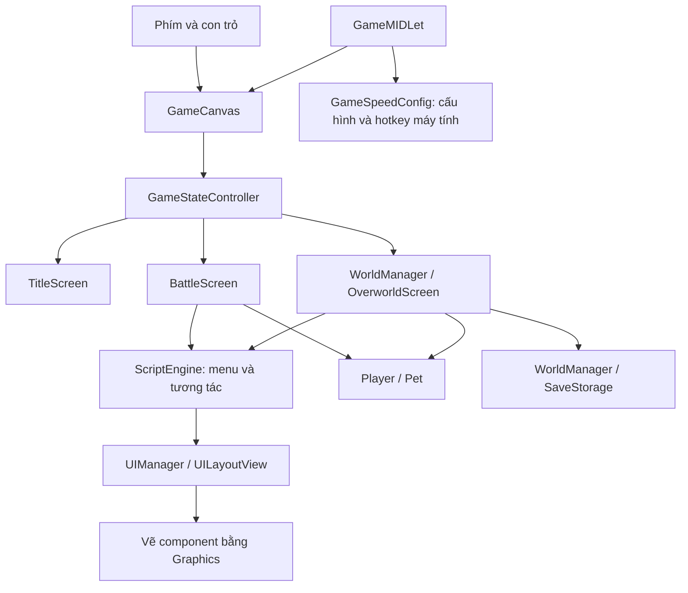

# Cẩm nang mở rộng Vương Quốc Sủng Vật

Tài liệu dành cho người sửa bản J2ME 240×320 trong repository này, chạy bằng
FreeJ2ME trên máy tính. Khảo sát định dạng ban đầu ngày 2026-10-02; cập nhật build source ngày
2026-10-03. Toàn bộ engine đã có Java hợp lệ trong `src/main/java/`. Những chữ
ký binary ngắn trong phần khảo sát là tên gốc; tra `tools/source-names.tsv` để
đối chiếu API source hiện tại. Xem [SOURCE-BUILD](SOURCE-BUILD.md).

**Trả lời nhanh:** thú/Pokémon là bản ghi dữ liệu, không phải mỗi loài một class.
100 loài hiện có dùng một hình gốc cho mỗi sprite; engine tạo thêm chuyển động.
Thay một loài có sẵn khá khác với mở rộng danh sách thành 101 loài. UI dùng layout
nhị phân riêng; thêm file Java hoặc ảnh chưa tự làm tính năng xuất hiện trong game.

## Mục lục và tra cứu theo nhu cầu

| Muốn làm gì? | Đọc phần |
| --- | --- |
| Biết sửa file nào mới có tác dụng | [1. Kiến trúc và build](#architecture) |
| Xem ảnh, database và animation | [2. Đọc tài nguyên](#inspect-assets) |
| Vẽ thú, viết bản ghi và tạo object | [3. Cấu trúc Pokémon](#pet-model) |
| Thay một loài trong 100 slot | [4. Quy trình A](#replace-pet) |
| Thêm loài thứ 101 | [5. Quy trình B](#append-pet) |
| Thêm chữ, icon, nút hoặc màn hình | [6. UI](#ui) |
| Thêm một tính năng hệ thống | [7. Tích hợp logic](#systems) |
| Thêm vật phẩm, kỹ năng, NPC, quest, map | [8. Các công thức mở rộng](#recipes) |
| Đọc/ghi đúng định dạng nhị phân | [9. Định dạng và công cụ còn thiếu](#formats) |
| Build, thử nghiệm, xử lý save và lỗi | [10. Kiểm chứng](#validation) |

Các lệnh dưới đây chạy từ thư mục gốc repository. “Đã kiểm chứng” chỉ áp dụng
cho phạm vi ghi bên cạnh ví dụ. “Thiết kế cần triển khai” là công việc phải làm
thêm; repository chưa có sẵn API hay công cụ được mô tả ở phần đó.

<a id="architecture"></a>
## 1. Kiến trúc và build: sửa ở đâu mới chạy?

### Source đang build và nguồn đối chiếu

| Nguồn | Vai trò thực tế | Cách sửa |
| --- | --- | --- |
| `src/main/java/` | Toàn bộ 68 class phục hồi + 3 helper | Sửa Java và build |
| `src/main/resources/` | Toàn bộ asset và manifest | Thay đúng đường dẫn resource |
| `original/game.jar`, `reference/runtime-patches/` | Oracle bytecode gốc và các patch trước phục hồi | Giữ làm đối chiếu; không dùng trong build |
| `reference/decompiled/` | Reference CFR lịch sử | Không được đưa vào build |

[project.py](../project.py) biên dịch với classpath chỉ có **API emulator**, rồi
đóng gói class mới và resources. Không đọc JAR gốc và không chồng binary patch.
Build từ chối `.class` trong resources. Xóa asset ở resources sẽ xóa nó khỏi JAR.
Sửa `src/main/java/game/Pet.java` sẽ thay logic thú đang chạy; sửa reference thì không.

Các hành vi từ 4 patch cũ (`an`, `game/h`, `game/i`, `game/k`) được giữ trong
source phục hồi. [Script patch lịch sử](../tools/patch_sms_and_shortcuts.py) chỉ
phục vụ oracle; không cần chạy để sửa source và có thể ghi đè thay đổi oracle.

### Luồng thực thi



`GameCanvas.run()` gọi cập nhật, repaint/serviceRepaints rồi nghỉ theo `BaseScreen.frameDelayMs`.
State cấp game do `GameStateController` quản lý; chế độ menu/gameplay còn được điều phối ở
world/battle và `ScriptEngine`. Không coi mọi số `case` trong các class là cùng một enum.
Sprite animation tiến theo lần cập nhật, nên thay tốc độ game cũng thay tốc độ
chuyển động và nhiều bộ đếm gameplay.

### Đối chiếu API trước khi viết Java

```bash
javap -classpath original/game.jar -p game.b aq aa ab ao
javap -classpath original/game.jar -p -c game.b
javap -classpath build/vuong-quoc-sung-vat-dev.jar -p game.BaseScreen game.Pet
```

Lệnh đầu xem chữ ký thật; `-c` xem bytecode; lệnh cuối cần build trước và xem bản
đã đóng gói. Reference hiện dùng `Pet.spriteId` và
`SpriteRenderer.loadSprite(..., hasExtendedAnimationSteps)`; các tên cũ `growthRate`
và `loop` đã được sửa. Boolean này chọn cách đọc mỗi bước animation, không trực
tiếp quyết định lặp. Mapping được xác định bằng owner và descriptor JVM; xem
[quy trình refactor](REFACTORING.md).

Tra bảng tên trong [SOURCE-MAP](SOURCE-MAP.md). Sửa source đã phục hồi trong
`src/main/java/`; chỉ dùng `javap`/reference để đối chiếu khi còn nghi ngờ về logic.
Không chép đè cây reference CFR lên source hiện tại vì nó còn lỗi dịch ngược.

<a id="inspect-assets"></a>
## 2. Đọc tài nguyên trước khi sửa

[recover_assets.py](../tools/recover_assets.py) xuất ảnh PNG và JSON để phân tích.
Nó **không nhập JSON ngược vào game**, và có áp dụng quy tắc tạo frame của engine
cho sprite 86–185. JSON sprite xuất ra có thể khác cấu trúc thô trong file gốc.

Nếu môi trường hiện tại có `build/asset-venv`, chạy:

```bash
vqsv_asset_preview=$(mktemp -d)
build/asset-venv/bin/python -B tools/recover_assets.py --output "$vqsv_asset_preview"
```

Trên checkout mới, thư mục `build/` không được Git lưu. Tạo môi trường riêng nếu cần:

```bash
python3 -m venv build/asset-venv
build/asset-venv/bin/python -m pip install Pillow
```

Lệnh xuất asset đã chạy thành công vào thư mục tạm. Bước cài Pillow cần mạng và
không cần chạy lại khi môi trường đã có thư viện.

| Kết quả trong thư mục xuất | Nội dung |
| --- | --- |
| `images/data/img/img_540.png` | Hình gốc Điện Miêu, 43×46 px |
| `sprites/154.json` | Modules, frames và animations sau quy tắc đặc biệt |
| `tables/database.json` | 9 bảng database |
| `tables/sprites.json` | 345 dòng ánh xạ sprite |
| `tables/chs.json` | Các hàng chuỗi, chưa nối các mảnh trong mỗi hàng |
| `maps/`, `tilesets/`, `events/` | Dữ liệu bản đồ, tileset, scene/room/script |
| `source_manifest.json` | Hash tài nguyên đầu vào để đối chiếu |

UI, `petArea`, `petRide`, `bqTask` và một số bảng hiệu ứng chưa có nhánh xuất riêng
trong công cụ. Có thể dùng reader cơ bản khi đã xác nhận đúng loader; không áp dụng
`short_rows()` cho mọi `.mid` vì một số file chứa byte hoặc nhiều bảng nối tiếp.

Ví dụ **đã chạy**, chỉ đọc file, không cần Pillow:

```python
from tools.recover_assets import Reader, SOURCE, short_rows, string_rows, sprite_data

def reader(relative):
    return Reader((SOURCE / relative).read_bytes(), relative)

r = reader("data/script/db.mid")
db = [short_rows(r) for _ in range(9)]
r.end()
r = reader("data/script/chs.mid")
text_rows = string_rows(r)
r.end()
r = reader("data/script/sprite.mid")
sprites = short_rows(r)
r.end()

pet_id = 68
row = db[0][pet_id]
sprite_id = row[17]
animation_id, *image_ids = sprites[sprite_id]
animation = sprite_data(reader(f"data/spr/spr_{animation_id}_all(r)"), animation_id)
print("".join(text_rows[row[0]]), row)
print(sprite_id, animation_id, image_ids)
print(animation["modules"], animation["frames"], animation["animations"])
```

Chạy đoạn Python bằng `python3 -B` từ root (dán vào heredoc hoặc REPL), để import
được `tools.recover_assets`. Không sửa JSON trong `build/recovered` rồi mong build
lấy dữ liệu đó: nguồn đóng gói vẫn là `src/main/resources`.

<a id="pet-model"></a>
## 3. Pokémon được định nghĩa và hiển thị thế nào?

### 3.1 Chuỗi liên kết của Điện Miêu

```text
db.mid: bảng 0, dòng 68
  [0]  = 78  -> chs.mid, hàng 78 -> "Điện Miêu"
  [17] = 154 -> sprite.mid, hàng 154 = [154, 540]
                  |                         |
                  v                         v
     data/spr/spr_154_all(r)       data/img/img_540.mid
     module/frame/animation       nội dung PNG, 43×46
```

`Pet.c()` nạp renderer từ cột 17; phần sách thú trong `ScriptEngine.aZ()` cũng lấy
cột này. Pet ID, sprite ID, animation ID, image ID và text ID là các không gian ID
khác nhau. Trong ví dụ sprite ID bằng animation ID, nhưng đó không phải cùng một trường.

Ảnh 540 chỉ được dòng sprite 154 tham chiếu trong bảng sprite hiện tại. Điều này
không thay thế việc tìm tham chiếu trực tiếp trong code hoặc các bảng khác khi sửa ảnh.

### 3.2 Cần vẽ bao nhiêu frame?

**Đối với cơ chế thú 86–185 hiện tại: một hình gốc đủ để giữ hành vi animation sẵn có.**
Không cần vẽ 5 hình chỉ vì JSON có 5 frame. Cả 100 file sprite thú có một module và
một frame gốc; 96 file có một animation thô, 4 file không có animation thô.
[AnimationCache](../src/main/java/game/AnimationCache.java), runtime `aa.a(int)`,
thay dữ liệu frame/animation của toàn bộ dải này khi nạp.

Điện Miêu có module `[0, 0, 0, 43, 46]`: ảnh số 0 trong danh sách ảnh của sprite,
vùng cắt x=0, y=0, rộng=43, cao=46. Frame thô `[0, -22, -46, 0]` đặt module 0 tại
offset x=-22, y=-46, transform=0, so với vị trí đặt sprite. Gốc nằm gần giữa chân;
không đặt hình theo góc trên trái màn hình rồi bỏ qua offset này.

| Frame runtime | Offset x | Offset y | Cách tạo |
| --- | ---: | ---: | --- |
| 0 | -22 | -46 | Gốc |
| 1 | -12 | -46 | Gốc +10 theo x |
| 2 | -19 | -46 | Gốc +3 theo x |
| 3 | -15 | -46 | Gốc +7 theo x |
| 4 | -32 | -46 | Gốc -10 theo x |

| Animation ID | Các cặp `(thời lượng, frame)` | Nhánh sử dụng |
| --- | --- | --- |
| 0 | `(2, 0)` | Trạng thái cơ bản, có thể lặp |
| 1 | `(1, 0), (1, 1), (1, 2), (1, 3), (1, 2)` | `Pet.d((byte)1)`, động tác tấn công |
| 2 | `(5, 0), (5, 4)` | `Pet.d((byte)2)`, chuyển về animation 0 |

Thời lượng tính theo bước cập nhật renderer, không phải mili giây hay FPS của
file ảnh. `SpriteRenderer.d()` tiến frame; đối số chuyển tiếp của
`d.a(byte, byte, boolean)` điều khiển trở về animation khác/lặp/giữ cuối.
Tư thế 3 của Pet dùng hiệu ứng riêng; một số loài có hiệu ứng hardcode theo pet ID.
Không tạo animation 3/4 chỉ vì thấy các case 3/4 trong Pet.

Để thay hình nhanh, giữ PNG trong suốt 43×46, điểm neo và vùng cắt. Khi đổi kích thước,
sửa module, offset, vùng va chạm/tấn công nếu có, rồi kiểm tra cả hai phía trận đấu.
Engine có phép lật sprite theo hướng; không cần tự vẽ ảnh đối thủ ngược chiều chỉ
để phục vụ phép lật hiện tại.

Muốn animation vẽ tay nhiều tư thế trong dải 86–185: phải đổi quy tắc `aa.a(int)`
đang ghi đè metadata, hoặc dùng animation ID ngoài dải với metadata đầy đủ. Đây là
thay đổi engine/asset, không chỉ thêm ảnh. Với NPC/nhân vật/thú cưỡi, hãy đọc sprite
được dùng: sprite 0 hiện có 44 modules, 33 frames, 12 animations; sprite 8 có 32,
16, 6. Không dùng định mức “một hình” của thú chiến đấu cho chúng.

### 3.3 Bản ghi loài: 23 số short

Bảng 0 của `db.mid` có 100 dòng, mỗi dòng 23 số. Runtime đọc qua `aq.c[0][petId]`.
Dòng 68 là:

```text
[78, 4, 0, 2, 2, 26, 18, 6, 4, 4, 4, 3, 20, 3, 4, 4, 0, 154, 2, 69, 0, 1, 0]
```

Các tên dưới đây mô tả tác dụng quan sát được, không phải tên schema gốc. Nguồn
chính: [Pet](../src/main/java/game/Pet.java),
[ScriptEngine](../src/main/java/game/ScriptEngine.java),
[BattleScreen](../src/main/java/game/BattleScreen.java).

| Cột | Giá trị | Ý nghĩa/tác dụng đã xác định | Nơi kiểm tra |
| --- | ---: | --- | --- |
| 0 | 78 | ID tên trong `chs.mid` | UI tên thú, `Pet.J()` |
| 1 | 4 | Hệ: 0 Hỏa, 1 Mộc, 2 Thổ, 3 Thủy, 4 Điện, 5 Quỷ, 6 Phong | `Pet.F()`, tính tương khắc |
| 2 | 0 | Mã dạng/tiến hóa; giá trị ở loài đích 1/2/3 được dùng để chọn nhánh và ngưỡng cấp | `Pet.R()`, `Pet.J()`; chưa gán tên cho mọi giá trị |
| 3 | 2 | Phẩm chất mặc định khi init với quality=-1 | `initPet`; bytecode hiện gọi random với hai đầu mút đều lấy cột 3 |
| 4 | 2 | Tham gia điều kiện sinh/nở thú; có nhánh kiểm tra bằng 5 | `ScriptEngine`, tìm truy cập `[0][n2][4]`; chưa xác nhận ý nghĩa đầy đủ |
| 5 | 26 | HP: hệ số nền | `initPet`, `Pet.V()` |
| 6 | 18 | HP: hệ số nhân cấp | Cùng công thức HP |
| 7 | 6 | HP: số cộng thêm | Cùng công thức HP |
| 8 | 4 | Công: hệ số nền | `initPet`, `Pet.V()` |
| 9 | 4 | Công: hệ số nhân cấp | Cùng công thức công |
| 10 | 4 | Công: số cộng thêm | Cùng công thức công |
| 11 | 3 | Thủ: hệ số nền | `initPet`, `Pet.V()` |
| 12 | 20 | Thủ: hệ số nhân cấp rồi chia 10 | Cùng công thức thủ |
| 13 | 3 | Thủ: số cộng thêm | Cùng công thức thủ |
| 14 | 4 | Chỉ số nhanh nhẹn/tốc độ: hệ số nền | `initPet`, `Pet.V()`, sử dụng `c[4]`/`d[4]` |
| 15 | 4 | Chỉ số đó: hệ số nhân cấp rồi chia 10 | Cùng công thức |
| 16 | 0 | Chỉ số đó: số cộng thêm | Cùng công thức |
| 17 | 154 | Sprite ID; **không phải growth rate** | Gán vào runtime `game.b.C`, `Pet.c()` |
| 18 | 2 | Chọn hàng bảng 8 để lọc kỹ năng có thể học | `Pet.F()` |
| 19 | 69 | Pet ID tiến hóa tiếp theo; -1 nếu không có | `Pet.J()`, `Pet.R()` |
| 20 | 0 | Mã nguyên liệu tiến hóa; nhánh kiểm tra dùng mã này +12 | `Pet.J()`; giữ nguyên nếu chưa thay chuỗi tiến hóa |
| 21 | 1 | Số lượng nguyên liệu cần kiểm tra | `Pet.J()` |
| 22 | 0 | Phân loại đặc biệt ảnh hưởng bắt thú, tương khắc và bộ đếm thu thập | `BattleScreen` bắt thú, `Pet.a(Pet)`, `Player.a(byte,int,byte)`; chưa đặt tên nghiệp vụ cho toàn bộ enum |

Hệ số phẩm chất 1–5 là `[90, 95, 100, 110, 125]`. Ví dụ HP trước các hiệu ứng khác:
`(col5 + col6 * level + col7) * hệ_số / 100`. Công dùng cột 8–10; thủ và tốc độ
dùng phép chia nguyên `/10` cho phần tăng theo cấp. Giá trị cuối ép về `short`;
đừng tăng số tùy ý mà bỏ qua tràn số. Cấp tối đa hiện được hardcode là 50.

### 3.4 Object thú đang chơi khác bản ghi loài

Ví dụ sau dùng API Java hiện tại; cấu trúc dữ liệu đã đối chiếu với bytecode gốc:

```java
game.Pet pet = new game.Pet();
pet.initPet(68, 7, (short)-1, (byte)2, (short)2, (byte)-1);
// getPetId(): pet ID; getLevel(): level; toSaveData(): dữ liệu lưu.
```

Điều kiện: `GameDatabase.gameDatabase` đã nạp 9 bảng. Không gọi tại thời điểm database còn null.
Sáu đối số lần lượt là pet ID, cấp, giá trị `c[5]` (-1: không gán thuộc tính đó),
giá trị ban đầu `c[6]` (ví dụ game dùng 2), phẩm chất 1–5 (hoặc -1 dùng mặc định),
mã biến thể ảnh hưởng chỉ số (-1: không áp dụng nhánh 7/8/9).
Reference hiện đặt tên lần lượt `speciesId`, `level`, `attributeId`, `initialState`,
`quality`, `statVariant`. `attributeId` là tên mô tả vị trí chỉ số `c[5]`; chưa xác
minh ý nghĩa nội dung đầy đủ. Đối số thứ ba không phải danh sách chiêu chủ động đã học.

`pet.toSaveData()` trong thử nghiệm trên trả:

```text
[68, 7, -1, 2, 2, -1, 150, 0, 0, 0]
```

Đó là `[petId, level, c[5], d[6], quality, variant, HP, exp, E, số_chiêu, ...]`,
tiếp theo là các ID chiêu rồi số lượt sử dụng còn lại tương ứng. `E` được giữ bằng
tên runtime vì chưa xác nhận đủ ý nghĩa. HP=150 trong bối cảnh player mới, chưa có
hiệu ứng huy chương. Chiêu nằm ở `z[]` và `y[]`, tối đa 5 slot; `g(byte)` thêm chiêu,
`G()`/`F()` tham gia học/chọn chiêu. Init object riêng chưa thêm thú vào đội,
chưa nạp sprite và chưa đăng ký thu thập. Luồng thêm đội nằm trong
[Player](../src/main/java/game/Player.java); đội hiện có 6 slot.

<a id="replace-pet"></a>
## 4. Quy trình A: thay một loài có sẵn

Ví dụ: biến slot 68 thành một thú mới nhưng giữ vị trí trong nhóm Điện.

1. Xuất dữ liệu và ghi lại các ID 68/78/154/540. Kiểm tra nơi dùng chung ảnh,
   text, metadata, các encounter và đường tiến hóa tới/từ loài này. Đừng thay mọi
   số 68 hoặc 78 bằng tìm-thay văn bản: cùng giá trị có thể thuộc không gian ID khác.
2. Vẽ PNG trong suốt 43×46 nếu giữ nguyên metadata. `img_540.mid` hiện chứa PNG
   thật; loader `ae.b()` đọc đường dẫn `.mid`. Lưu **nội dung PNG** vào
   `src/main/resources/data/img/img_540.mid` khi triển khai. Chỉ thêm
   `img_540.png` sẽ không đổi đường dẫn mà loader này đang đọc.
3. Đổi tên ở hàng 78 của `chs.mid`, giữ cấu trúc bảng và độ dài UTF-16. Nếu tên
   dài hơn, ghi lại length; không chèn byte vào giữa file mà giữ header cũ.
4. Đổi các cột chỉ số đã hiểu của dòng 68 trong bảng 0; giữ 23 phần tử. Ban đầu
   giữ hệ, tiến hóa và những enum chưa rõ để tách lỗi hình ảnh khỏi lỗi gameplay.
5. Ghi lại toàn bộ `db.mid` gồm 9 bảng. [Ví dụ ghi bảng](#binary-example) chỉ
   tạo bản thử ở thư mục tạm; cần chuyển file đã kiểm tra vào đúng resource để áp dụng.
6. Build bằng `python3 project.py build`, sau đó `python3 project.py run` để thử.
   Game đang chạy không tự tải lại JAR; đóng phiên cũ trước khi mở bản mới.
7. Thử gặp/bắt thú, đội hình, sách thú, cả hai phía trận đấu, lên cấp, tiến hóa
   và lưu/đọc. Muốn thấy thú ngay cần điểm encounter/quà tặng/test hook có chủ đích;
   tạo object riêng không tự spawn vào thế giới.

Ví dụ encounter thật trong `petArea.mid` là
`[1,4,2,6,7,76,0,1,2,68,0,2,2]`. Loader `WorldManager.T()` tách từ cột 5 thành
các cụm 4 số, phân nhóm theo phần tử thứ hai của cụm. Hãy lần theo tiếp luồng
chọn trận trong world/battle trước khi đặt tên đầy đủ cho các trọng số/tham số.
Không coi bốn số cuối là bốn pet ID.

**Tác động tới save:** thú cũ có pet ID 68 cũng dùng định nghĩa/ảnh mới. Đây là thay
nội dung slot; không tạo danh tính mới để tồn tại song song với Điện Miêu cũ.

<a id="append-pet"></a>
## 5. Quy trình B: thêm loài thứ 101

Đây là **thiết kế cần triển khai thêm**, chưa có lệnh “add-pet”. Chỉ append dòng
database sẽ không hoàn tất sách thú, nhóm hệ, animation và tương thích save.

1. Chọn pet ID mới bằng cách append, không dịch ID cũ. Với dữ liệu hiện tại ID
   tiếp theo là 100. Append tên vào bảng chuỗi và bản ghi 23 số vào bảng 0; tham
   chiếu tên mới, sprite mới và kỹ năng/tiến hóa hợp lệ.
2. Chọn sprite/animation/image ID trống sau khi kiểm kê toàn bộ tài nguyên.
   Bảng sprite hiện có 345 dòng, nên 345 là chỉ mục append kế tiếp của bảng,
   **không phải cam kết mọi không gian ID đều trống**. Nên giữ sprite ID bằng
   animation ID cho sprite mới: loader nạp bằng `spriteTable[id][0]`, nhưng nhánh
   release của renderer lại dùng sprite ID để giảm cache animation.
3. Tạo ảnh và metadata mới. Không dùng công thức `86 + petId` cho ID 100: 186 đã
   nằm ngoài dải thú đặc biệt và có thể là nội dung khác. Với animation ngoài dải,
   ghi đầy đủ các frame/animation 0,1,2 cần dùng; không được trông chờ engine tự sinh.
   Cache có 1000 slot animation và 50000 slot ảnh, nhưng mapping ID còn lưu bằng
   signed short: kiểm tra cả giới hạn cache lẫn miền 0–32767 của tham chiếu ảnh,
   không chọn image ID 40000 chỉ vì cache có chỗ.
4. Mở rộng mô hình nhóm/sách thú trong `Player` và cách truy cập của `ScriptEngine`.
   Hiện `W=[0,16,32,48,64,76,88]`, `X=[16,16,16,16,12,12,12]`; `C` và `D`
   lưu trạng thái thu thập theo nhóm. UI dùng phép `W[hệ]+vị_trí`. Append thú hệ
   Điện ở ID 100 không tự thuộc khoảng Điện 64–75. Nếu cần giữ mọi ID cũ và cho
   phép thêm vào bất kỳ hệ nào, phải chuyển các nơi truy cập này sang danh sách
   pet ID theo hệ, thay vì chỉ tăng một phần tử `X`.
5. Rà các ép `(byte)petId` trong thu thập, tiến hóa và event. ID 100 còn trong
   miền signed byte, nhưng đó không phải bằng chứng các bảng đã đủ chỗ. Vượt 127
   cần sửa cả cách ghi/đọc và logic so sánh, không chỉ đổi kiểu một trường.
6. Thêm cách nhận thú: encounter, quà NPC hoặc script; cập nhật sách thú, tiến
   hóa và các bộ đếm liên quan. Tái sử dụng kỹ năng hiện có trước; nhóm chiêu hiện
   chia thành 7 hệ ×10 ID, nên thêm hệ mới là một thay đổi riêng.
7. Sửa các class tương ứng trong `src/main/java/game/`, nhất là `Pet`,
   `Player`, `ScriptEngine` và `WorldManager`; cập nhật declaration và caller
   khi đổi API. Sửa reference lịch sử không thay bản chạy.
8. Thiết kế đọc save cũ trước khi tăng mảng: `WorldManager` ghi các mảng `C/D`
   theo thứ tự, không ghi độ dài từng hàng tại chỗ đó. Reader mới đọc số lượng
   khác sẽ lệch phần dữ liệu tiếp theo. Dùng migration có phân biệt định dạng hoặc
   vùng lưu mở rộng riêng; giữ bản sao save cũ để kiểm thử. Pet instance được ghi
   bằng int không loại bỏ vấn đề byte và mảng cố định ở các phần khác.

Điều kiện hoàn tất: slot 0–99 giữ nguyên danh tính; thú mới xuất hiện, chiến đấu,
được ghi nhận đúng hệ, lưu/đọc được; các loài cũ và save cũ vẫn được xử lý theo
chính sách tương thích đã chọn. Chưa thực hiện các thay đổi engine này trong đợt
viết tài liệu.

<a id="ui"></a>
## 6. Thêm chữ, icon, nút và màn hình UI

### 6.1 Những thành phần thực sự tham gia

| Vai trò | Reference → runtime | Ghi chú |
| --- | --- | --- |
| Quản lý UI đang mở | `UIManager` → `ab` | Cache theo đường dẫn, stack hiển thị, active view |
| Đọc layout và tìm component | `UILayoutView` → `ao` | Parser `.ui`, lookup, điều hướng và vẽ |
| Giao diện component | `UIComponent` → `w` | Vẽ, geometry, visibility, ID, con |
| Container | `MenuWidget` → `al` | Type 0 trong parser |
| Widget có chữ/icon | `ItemListWidget` → `af` | Type 1; nội dung/hình nằm ở đối tượng trả bởi `h()` |
| Widget lưới/hộp | `MessageBox` → `ac` | Type 2; bố cục khác type 1 |
| Thuộc tính chữ/nền/icon | `UIStyle` → `k` | Style dùng chung; không phải một type `.ui` riêng |
| Chọn/focus | `UISelectionConfig` → `z` | Cấu hình các nhóm và đường điều hướng |
| Render sprite trong UI | `SpriteWidget` → `m` | Cần phân biệt sprite ID với frame/icon index |
| Callback | `ScriptEventListener` → `i` | Chữ ký runtime `void a(int[])` |

Nguồn: [UIManager](../src/main/java/game/UIManager.java),
[UILayoutView](../src/main/java/game/UILayoutView.java),
[UIComponent](../src/main/java/game/UIComponent.java).
Layout hiện có tối đa 200 chỗ trong mảng component của view; container `al` có
60 chỗ cho con. Đây là giới hạn cấp phát của code hiện tại, không phải quy tắc
tự động mở rộng khi thêm node.

### 6.2 Trường hợp A: đổi nội dung component có sẵn

`help.ui` được dùng lại cho Trợ giúp/Giới thiệu/Tùy chọn. Nhánh `ScriptEngine.s()`
mở nó với đối số 257, đặt component 5 thành `Tùy chọn`, và sử dụng component 8
cho nội dung. `GameSpeedConfig` hiện cập nhật vùng này. Đối số 257 được chuyển
cho phần nạp sprite của các widget; đừng coi nó là một bitmask tùy ý.

Ví dụ helper dưới đây **đã kiểm tra biên dịch** với JAR gốc, chưa thử hiển thị
trên emulator. Class ở default package để gọi `ab`, `ao`, `w`, `k`:

```java
public final class ExampleUiText {
    public static boolean updateOptionsText(String text) {
        ab manager = ab.a();
        if (!manager.b("/data/ui/help.ui") || manager.a == null) return false;
        ao view = manager.a;
        w title = view.a(5);
        w content = view.a(8);
        if (title == null || content == null) return false;
        k titleStyle = title.h();
        k contentStyle = content.h();
        if (titleStyle == null || contentStyle == null) return false;
        if (!"Tùy chọn".equals(titleStyle.a)) return false;
        contentStyle.a = text;
        return true;
    }
}
```

Tạo helper chưa làm nó được gọi: nối lời gọi vào lúc menu vừa mở hoặc hook cập
nhật phù hợp. Nếu cùng sửa component 8, hãy hợp nhất với `GameSpeedConfig` hoặc
đổi watcher hiện tại; nếu không, watcher sẽ ghi lại nội dung tốc độ mỗi khoảng
30 ms. Dùng `#n` để xuống dòng theo renderer của game, thử độ dài và glyph tiếng Việt.

### 6.3 Trường hợp B: thêm icon hoặc nút vào layout

1. Chọn layout gần nhất và liệt kê ID/type/bố cục hiện có từ parser hoặc probe
   runtime. `.ui` là binary, không thể chèn một thẻ XML/JSON. ID lấy bằng
   `ao.a(id)` là ID widget, không mặc định là vị trí trong mảng.
2. Nếu đã có widget phù hợp đang ẩn, kiểm tra các nhánh code cùng sử dụng nó
   trước khi tái sử dụng. Nếu thêm node mới, cần một reader/writer `.ui` giữ được
   cấu trúc cây, cấu hình focus và mọi trường của type đó; hiện repo chưa có.
3. Chọn type có sẵn, ID chưa dùng, parent và geometry trong màn hình 240×320.
   Với chữ/icon như type 1, giữ cấu trúc thuộc tính chữ, màu, sprite/frame,
   canh lề và thông tin focus. Cập nhật số lượng con; không append byte ở cuối
   file rồi mong parser tự nhận.
4. Bổ sung ảnh/metadata nếu icon chưa có. Frame index trong sprite UI 257 khác
   với image ID. Một icon tĩnh không bắt buộc có nhiều frame; animation phải theo
   cách caller thực sự tiến frame.
5. Nối thứ tự/đường điều hướng trong cấu hình chọn `z`, trạng thái hiển thị,
   nhánh xác nhận và hành động ở controller/script. Vẽ được hình nút chưa đồng
   nghĩa nút nhận phím hoặc con trỏ.
6. Build/run; thử Lên/Xuống/Trái/Phải, 5/Fire/softkey và Quay lại; thử mở/đóng
   nhiều lần, dữ liệu rỗng, text dài, menu nền và modal chồng lên nhau.

Các mask là mask bit, không phải keycode: ví dụ 196640 gộp confirm được dùng
trong nhiều menu, 262144 là soft-right; các nhánh khác có thể dùng mask kết hợp
khác. Đọc [BaseInputHandler](../src/main/java/game/BaseInputHandler.java) và
caller cụ thể, không áp một mask cho tất cả màn hình. Các vùng pointer của
GameCanvas cũng không cung cấp tự động hit-test cho mọi nút mới.

### 6.4 Trường hợp C: thêm màn hình hoặc loại widget mới

Với màn hình mới, trước tiên clone bố cục đã hiểu sang một đường dẫn resource
mới, giữ ID nội bộ mà controller sẽ truy cập. Thiết kế rõ: nơi mở, state trước,
state khi mở, dữ liệu truyền vào, cập nhật, xác nhận/hủy, nơi quay về và giải
phóng. Dùng `ab.a(path, spriteId, listener)` để mở, `ab.a(path)` để đóng; `ab.b(path)`
kiểm tra path trên cùng, `ab.c(path)` kiểm tra có trong stack. Đây là chữ ký thật,
khác tên đã đổi trong reference.

Nhánh `dialog.ui` có cách cache/reuse riêng; không suy rộng vòng đời đó cho mọi
màn hình. Cần đồng bộ state của controller với stack UI: đóng view mà vẫn ở
state xử lý phím cũ có thể gây truy cập component không tồn tại.

Nếu cần hành vi mà ba type parser chưa có, phải bổ sung class triển khai `w`,
parser, render/input và cleanup tương ứng. Không có plugin registry tự khám phá
widget mới. Không dùng JavaFX/Swing làm UI trong Canvas J2ME; AWT trong ví dụ tốc
độ là cơ chế tích hợp với emulator trên máy tính.

<a id="systems"></a>
## 7. Thêm tính năng hệ thống

### 7.1 Chọn đường tích hợp

| Loại thay đổi | Điểm bắt đầu | Điều kiện để có hiệu lực |
| --- | --- | --- |
| Tính toán/cấu hình độc lập | Class mới trong `src/main/java` | Phải có caller khởi tạo/gọi nó |
| Tác động dữ liệu đã nạp | Loader/caller của database hoặc resource | Gọi sau khi dữ liệu sẵn sàng; xử lý khi nạp lại |
| Menu, hành vi trong map/trận | World/battle và `game.h` | Nối state, input, update/render và đóng màn hình |
| Màn hình cấp game | `game.i`, `game.e` | Rà cả chuyển state, cập nhật, vẽ, pause/resume; `game.i.a(byte)` hiện bỏ qua giá trị ≥24 |
| Sự kiện cốt truyện | Scene/room script và interpreter | Opcode và tham số phải được interpreter hỗ trợ |
| Thông tin cần lưu | `game.k` + `ar` hoặc vùng lưu riêng | Có reader/writer và chính sách save cũ |

Nhiều class là `final`; sửa trực tiếp source hoặc thay thiết kế có kiểm tra
caller. Engine/UI đều đã thuộc package `game`, nên các class này gọi nhau bằng
API Java thông thường. Helper tốc độ desktop còn ở default package và entrypoint
gọi qua reflection. Khi thêm API, cập nhật cả declaration, caller và override.

### 7.2 Ví dụ thật: hệ thống tốc độ

Đọc [GameSpeedConfig](../src/main/java/GameSpeedConfig.java),
[GameEngineBridge](../src/main/java/GameEngineBridge.java) cùng
[GameMIDLet](../src/main/java/game/GameMIDLet.java):

```text
GameMIDLet constructor
  -> tạo Canvas và bắt đầu thread game
  -> reflection gọi GameSpeedConfig.init()
       -> loadConfig()
       -> applySpeed() -> reflection ghi an.c
       -> đăng ký AWT KeyEventDispatcher
       -> tạo watcher cập nhật chữ trong help.ui

F1–F4 / các phím đã đăng ký
  -> setMultiplier()
  -> applySpeed() + saveConfig()
```

Các mức thông thường 1/2/3/4 tương ứng delay 66/33/22/16 ms. Đây là delay mục tiêu,
không phải bảo đảm FPS đo được. `loadConfig()` ưu tiên `frame_delay` hợp lệ hơn
`speed` nếu cả hai cùng có. Nó tìm lần lượt `speed.conf`, `../speed.conf`,
`runtime/speed.conf` theo working directory. `project.py run` chuyển cwd sang
`runtime` và chép cấu hình root nếu mới hơn, nên kết quả phụ thuộc cả bước này.

Giới hạn cần hiểu trước khi lấy làm mẫu:

- `java.awt` và `java.io.File` phục vụ môi trường desktop; chưa có toolchain để
  chuyển nguyên cơ chế này sang CLDC/Nokia thật.
- Hook khởi tạo chạy sau khi Canvas đã mở thread; database/UI có thể chưa sẵn
  sàng. `init()` có chốt một lần, nhưng không phải callback “game đã load xong”.
- Watcher daemon ghi UI khoảng mỗi 30 ms, khác thread game. Đây là cách tích hợp
  hiện có, không phải cơ chế đồng bộ tổng quát. Tính năng mới nên đưa cập nhật
  trạng thái/UI về game thread khi đã có hook thích hợp.
- `handleJ2meKey()` có hàm xử lý `*`/`#`, nhưng không thấy lời gọi nối vào
  GameCanvas gốc. Không kết luận phím hoạt động chỉ từ comment hoặc tên method.
- Nhiều nhánh bắt lỗi bị bỏ qua. Khi viết tính năng mới, thêm log có ngữ cảnh
  cho lỗi khởi tạo/nạp dữ liệu thay vì để người thử không biết hook đã chạy chưa.

### 7.3 Quy trình cho một hệ thống mới

1. Viết tình huống cụ thể: người chơi mở ở đâu, thao tác gì, trạng thái nào đổi,
   có cần tồn tại sau khi thoát game không. Chốt dữ liệu đầu vào/đầu ra trước UI.
2. Chọn chủ sở hữu trạng thái: cấu hình toàn cục, player, pet, room, battle hay
   session. Tránh lấy một mảng hiện có làm nơi lưu tạm nếu chưa hiểu mọi caller.
3. Tạo phần logic nhỏ có tên rõ; xác định hook khởi tạo và thời điểm dữ liệu sẵn
   sàng. Nếu chưa có hook, sửa caller trong source thành một bước bắt buộc.
4. Nối input, cập nhật và UI. Chỉ xử lý phím trong đúng state; khi đổi màn hình
   cần reset/tiêu thụ input phù hợp để phím xác nhận không lọt xuống gameplay.
5. Xử lý mở/đóng/pause/đổi map/hết trận: dừng bộ đếm, bỏ listener và trả tài nguyên
   nếu tính năng chỉ sống trong màn hình. Tránh đăng ký listener/thread lặp lại.
6. Nếu cần lưu, xác định format và reader tương ứng. Với dữ liệu mới độc lập,
   có thể dùng record riêng có version; nếu sửa record cũ phải có migration và
   cách phân biệt save cũ. Đây là lựa chọn khi triển khai, repo chưa có framework migration.
7. Biên dịch, kiểm tra entry trong JAR, thử trạng thái bình thường/lỗi/thoát giữa
   chừng và hồi quy các hệ thống chạm tới. Ví dụ cấu hình cần thử thiếu file,
   giá trị không hợp lệ và khởi động lại; hệ thống gameplay cần thử lưu/đọc.

Template dùng khi bắt đầu công việc:

```text
Tính năng / tình huống người chơi:
Trạng thái sở hữu / giá trị mặc định:
Resource và ID mới hoặc tái sử dụng:
Hook khởi tạo / input / update / render / cleanup:
Tên reference -> tên binary/chữ ký phải tương thích:
Save: không lưu / record riêng / migration record cũ:
Tiêu chí kiểm tra và thao tác quay về phiên bản trước:
```

<a id="recipes"></a>
## 8. Vật phẩm, kỹ năng, NPC, nhiệm vụ và bản đồ

Các công thức sau mô tả quy trình triển khai. Chưa thêm nội dung thật vào game.
Sau khi có resource/code hoàn chỉnh trong source, dùng chung hai lệnh
`python3 project.py build` và `python3 project.py run`.

### 8.1 Vật phẩm

**Ví dụ đang có:** Bánh Sandwich, bảng database 4, dòng 4:
`[265,29,282,100,0,1,50,50]`. Các trường đầu gồm tên, icon, mô tả, giá; nhánh
hiệu ứng 1 trong `Pet.w(int)` hồi HP theo phần trăm + số cố định. Hàng này dùng
50 và 50 cho phép tính đó. Không phải mọi hàng bảng 4 đều có 8 phần tử.

**Chuẩn bị:** tên/mô tả trong `chs.mid`, icon trong sprite UI thích hợp, bản ghi
cùng loại hiệu ứng và cách nhận/mua. Tái sử dụng hiệu ứng trước khi tạo enum mới.

**Nối vào game:** lần theo [Player](../src/main/java/game/Player.java)
để biết túi nào chứa vật phẩm, [ScriptEngine](../src/main/java/game/ScriptEngine.java)
để biết menu/shop và [Pet.w(int)](../src/main/java/game/Pet.java) để biết
hiệu ứng. Danh mục/nhóm và xử lý một số ID hardcode; append dòng chưa tự thêm vào
shop hay đúng ngăn túi. Nếu tạo effect kind mới, thêm cả nhánh dùng vật phẩm và
điều kiện cho phép dùng trong/ngoài trận.

**Build/chạy:** ghi lại bảng/chuỗi/icon, nối nguồn nhận rồi chạy hai lệnh trên.
**Kiểm tra:** mua, nhận, xếp chồng, dùng khi đầy HP/hết PP, tiêu hao đúng số lượng,
bán và lưu/đọc. **Lỗi thường gặp:** coi mọi item thuộc cùng bảng, nhầm icon index
với sprite ID, dùng row length cố định, đổi effect kind nhưng thiếu nhánh thực thi.

### 8.2 Kỹ năng và hiệu ứng chiến đấu

**Ví dụ đang có:** Điện giật ID 40, bảng 1:
`[4,157,569,100,0,45,0,-1,-1,0]`; text tên là hàng 157. Bảng này hiện có 70 hàng,
mỗi hàng 10 số, nhóm 10 kỹ năng cho mỗi hệ. `Pet.F()` lọc khả năng học theo bảng 8;
các nhánh tính sát thương còn switch theo skill ID.

**Chuẩn bị:** tên/mô tả, thông số chiêu, điều kiện học, lượt sử dụng, animation/
hiệu ứng nếu khác hiện tại. Đọc [SkillEffect](../src/main/java/game/SkillEffect.java),
[Pet](../src/main/java/game/Pet.java) và
[BattleScreen](../src/main/java/game/BattleScreen.java); lần loader của
`effect.mid`, `speffect.mid`, `bufDebuf.mid` và sprite tương ứng.

**Nối vào game:** sửa dữ liệu, danh sách học/trang bị và logic sát thương/trạng
thái. Append skill 70 không tự trở thành chiêu thứ 11 của hệ Điện: vòng duyệt
vẫn là `hệ*10 .. hệ*10+9`. Hiệu ứng hình ảnh cũng cần caller khởi tạo/cập nhật/
kết thúc; `SkillEffect` có các loại effect hardcode.

**Build/chạy:** hoàn tất cả metadata lẫn caller rồi build/run. **Kiểm tra:** học
chiêu, chọn mục tiêu, trừ PP, sát thương, buff/debuff, mục tiêu chết, hai phía
trận và lưu/đọc bộ chiêu. **Lỗi thường gặp:** chỉ có animation mà không có damage,
chiêu không nằm trong tập có thể học, index vượt mảng hoặc effect không kết thúc
làm trận bị kẹt. Đừng dùng kết quả CFR có `GOTO` chưa khôi phục làm Java chạy được.

### 8.3 NPC và hội thoại

**Ví dụ đang có:** `scene_1.mid`, room 0 là Thủy Mộc Thôn, trỏ map 2; danh sách
tên actor bắt đầu với Hart, Emily, Dodo. Actor đầu có fields
`[0,208,1,354,150,1,0,1,0,0,0,0,-1]`. Đây là ví dụ để truy trace loader, không phải
mẫu “NPC nói chuyện” dùng chung cho mọi kind.

**Chuẩn bị:** sprite có hướng/animation cần dùng, tọa độ, loại actor, tên,
điều kiện tương tác, chuỗi hội thoại và script được kích hoạt. Đọc
[NpcEntity](../src/main/java/game/NpcEntity.java), loader scene trong
[WorldManager](../src/main/java/game/WorldManager.java) và interpreter
[OverworldScreen](../src/main/java/game/OverworldScreen.java).

**Nối vào game:** thêm actor đúng nhánh kind của room, cập nhật số lượng và các
tham chiếu actor/event; thêm tên/chữ ở đúng bảng mà caller sử dụng. Một số hội
thoại từ `npcDialog.mid`, các chuỗi event nằm trong string pool của room.
Tọa độ actor là tọa độ world theo loader, không mặc định là chỉ số ô tile.

**Build/chạy:** cần writer scene tính lại kích thước room; xuất resource hợp lệ
rồi build/run. **Kiểm tra:** gặp NPC, hướng đứng/đi, va chạm, tương tác lần đầu/lặp
lại, điều kiện trước/sau quest, quay lại room sau khi load save. **Lỗi thường gặp:**
thêm sprite mà quên actor, sai kind/field count, chỉ đổi tên trong bảng không
được dùng, đổi index actor làm script cũ trỏ sang nhân vật khác.

### 8.4 Nhiệm vụ và sự kiện

**Ví dụ đang có:** hàng 0 `mTask.mid` là “Vòng loại sơ khảo”; hàng 0 `bTask.mid`
là “Bắt sủng vật 1”. Chúng là chuỗi, không chứa toàn bộ logic nhiệm vụ.
`OverworldScreen` còn đọc **hai bảng byte liên tiếp** từ `bqTask.mid`, thực thi
opcode trong scene và giữ trạng thái event/quest.

**Chuẩn bị:** điều kiện nhận, tiến trình, điều kiện hoàn thành, thưởng, lời thoại,
quest/event ID và hành vi khi quay lại/load. Ưu tiên biến thể của một quest thật
có flow tương tự, giữ nguyên ngữ nghĩa các opcode chưa hiểu.

**Nối vào game:** cập nhật text, các bảng liên kết và chuỗi lệnh tương ứng trong
scene; trace `ScriptCommand` → `ScriptSequence` → interpreter. Đổi text không
thay điều kiện nhận/thưởng. Nếu cần opcode mới, thêm parser dữ liệu nếu cấu trúc
đổi và cả nhánh khởi chạy/chờ/hoàn tất trong interpreter. Nhiều lệnh chạy qua
nhiều tick nên không được bỏ qua cơ chế chờ và tăng program counter.

**Build/chạy:** pack lại scene/bảng liên quan rồi build/run. **Kiểm tra:** chưa đủ
điều kiện, nhận một lần, đủ điều kiện, nhận thưởng, không nhận thưởng lặp, bỏ dở
và save/load giữa chừng. **Lỗi thường gặp:** nhầm quest ID với event ID theo room,
thiếu liên kết trigger, vượt giới hạn byte của bộ đếm lệnh hoặc mảng trạng thái.
Constructor hiện có mảng event theo 127 vị trí và bảng tiến trình `short[200][2]`;
cần đọc cách index trước khi mở rộng, không xem đây là dung lượng vô hạn.

### 8.5 Bản đồ, tileset và chuyển room

**Ví dụ đang có:** map 2 ở Thủy Mộc Thôn: version 1, tileset 2, 26×20 ô,
tile size 16; kích thước suy ra 416×320 px. File có byte cuối `ff` được công cụ
giữ trong `trailing_bytes`.

**Chuẩn bị:** các ảnh tileset, danh sách module trong `mod_*.mid`, ánh xạ ảnh
`modInfo.mid`, dữ liệu ô/layer của map và room chứa actor/event/điểm vào-ra.
Đọc [MapEngine](../src/main/java/game/MapEngine.java),
[TileMapRenderer](../src/main/java/game/TileMapRenderer.java) và
[WorldManager](../src/main/java/game/WorldManager.java).

**Nối vào game:** thay map cũ để thử trước; tạo map mới thì phải có room trỏ tới
map ID đó và script/cổng dẫn đến room. Phân biệt map ID, scene ID và room index.
Khi thêm room/scene, rà các bảng đếm/offset cố định của WorldManager, bảng
encounter, cưỡi thú và dữ liệu lưu event. Một file `map_*.mid` đứng riêng chưa
thể được người chơi đi tới. Layer type quyết định cách dùng ô/đối tượng; không
giả định mọi layer đều là ảnh nền hoặc mọi giá trị tile đều là va chạm.

**Build/chạy:** pack map/tileset/scene liên quan rồi build/run. **Kiểm tra:** mép
map, camera, che khuất, va chạm, NPC, cổng hai chiều, encounter, cưỡi thú và
save/load tọa độ. **Lỗi thường gặp:** sai đơn vị tile/pixel, sai phiên bản tọa độ
byte/short, sprite vượt atlas, cập nhật map nhưng không cập nhật room/offset.

<a id="formats"></a>
## 9. Định dạng nhị phân và đường ghi dữ liệu

### 9.1 Quy ước nền

Các số nhiều byte dưới đây là **big-endian**. Short/int là signed theo Java;
byte cũng signed trừ chỗ loader xử lý unsigned hoặc mask. Giá trị -1 được dùng
ở nhiều nơi làm sentinel; đừng chuyển tất cả thành unsigned. Tên `.mid` không
xác định định dạng: ảnh 540 là PNG, `db.mid` là bảng, `sound/0.mid` là âm thanh.

| Loại | Cấu trúc đọc | Nguồn |
| --- | --- | --- |
| `short[][]` | i16 số hàng; mỗi hàng: i16 số phần tử, rồi các i16 | `EngineUtils.a(InputStream)`; Python `short_rows` |
| `byte[][]` | i16 số hàng; mỗi hàng: i16 số phần tử, rồi các i8 | `EngineUtils.b(InputStream)` |
| `String[][]` | i16 số hàng; mỗi hàng i16 số chuỗi; mỗi chuỗi có length u8, nếu 255 thì đọc i16 length; sau đó length đơn vị UTF-16BE | `EngineUtils.c(InputStream)`; `string_rows` |
| `db.mid` | 9 bảng `short[][]` liên tiếp, không có header “9 bảng” phía trước | `GameDatabase` / `aq` |
| `sprite.mid` | Một bảng `short[][]`; mỗi hàng = animation ID + danh sách image ID | `SpriteRenderer` / `d` |
| `bqTask.mid` | Hai bảng `byte[][]` liên tiếp | Constructor `OverworldScreen` |

Không mặc định mọi bảng database dùng cột 0 làm tên:

| Bảng | Số hàng hiện tại | Vai trò chính |
| --- | ---: | --- |
| 0 | 100 ×23 số | Loài thú |
| 1 | 70 ×10 số | Kỹ năng; tên ở cột 1 |
| 2 | 8 | Huy chương và thông số tác dụng |
| 3 | 18 | Nhóm vật phẩm/thuộc tính dùng trong trang bị và tính toán |
| 4 | 15 | Vật phẩm dùng được, bóng bắt, thuốc; độ dài hàng thay đổi |
| 5 | 11 | Vật phẩm đặc biệt/nhiệm vụ |
| 6 | 15 | Trạng thái buff |
| 7 | 11 | Trạng thái debuff |
| 8 | 4 ×5 số | Ngưỡng/nhóm cho chọn kỹ năng học |

Đây là bản đồ vai trò; chưa phải schema đầy đủ cho mọi cột của tám bảng còn lại.

### 9.2 Sprite và ảnh

Một file `spr_N_all(r)` gồm năm khối theo thứ tự: modules, frames, animations,
collision, attack. Khối phẳng có i16 số hàng, i16 số cột rồi các i16. Khối nhiều
hàng có i16 số hàng, i16 số cột; mỗi hàng có i16 số nhóm rồi `số_nhóm*số_cột` i16.

- Module có 5 số: index ảnh trong sprite, x, y, width, height.
- Frame gồm các nhóm 4 số: module index, offset x, offset y, transform.
- Animation thông thường `false` đọc cặp duration/frame; chế độ `true` đọc nhóm
  4 số. Giữ đúng chế độ loader/caller; không coi boolean này là bật/tắt loop.
- Collision/attack là các nhóm 5 số, bắt đầu bằng frame index, theo sau là dữ
  liệu vùng. Cache chuyển chúng thành các hàng theo frame khi nạp.

Loader sprite và loader UI hiện cấp buffer 20000 byte. Khi tăng số module/frame
hoặc node, phải kiểm tra kích thước file và cách reader đọc buffer, không chỉ
kiểm tra count từng mảng.

`recover_assets.sprite_data()` áp dụng quy tắc đặc biệt cho animation ID 86–185.
Muốn round-trip nguyên bản phải đọc/giữ khối thô trước biến đổi; xuất JSON rồi
serialize thẳng có thể thay đổi file dù bạn chưa sửa gì.

Ảnh `img_*.mid` được loader đọc thành byte ảnh. Các texture khác có thể là dạng
đóng gói width/height/depth/color/palette/IDAT, được `EngineUtils` dựng lại PNG.
`recover_assets.texture_png()` giải mã chúng; nó không cung cấp encoder chiều
ngược lại. Kiểm tra header và nhánh loader trước khi thay một texture bằng PNG.

### 9.3 Scene, room, event và map

`scene_*.mid` bắt đầu bằng i16 số room, rồi bảng i16 kích thước từng room, rồi
payload của từng room. Room chứa string pool, tên, map ID, trường chưa rõ,
actor theo kind, tên actor và các event. Thay độ dài chuỗi/actor/lệnh cần tính
lại kích thước room và các count liên quan.

Mỗi event có i16 số lệnh. Một lệnh theo [ScriptCommand](../src/main/java/game/ScriptCommand.java):

```text
i16 opcode
i8  tổng số tham số
i8  số tham số số
i16[] tham số số
i16[] chỉ mục chuỗi trong string pool của room
```

Số chỉ mục chuỗi = tổng số tham số - số tham số số. Reader Python dùng unsigned
cho hai count, nhưng Java đọc byte signed; không coi 255 là count hợp lệ. Tương
tự, `ScriptSequence` ép số lệnh sang byte và giữ program counter bằng byte:
giới hạn runtime vẫn phải kiểm tra dù format chứa i16. Ý nghĩa opcode nằm ở
interpreter, không được suy từ vị trí hoặc tên file. `.mib` như `scene_13.mib`
không được công cụ hiện tại giải mã bằng nhánh `.mid`.

Map có i8 version, i8 tileset, width/height, i8 tile size, i8 số layer. Width/
height và tọa độ cell là i8 khi version=1, i16 ở nhánh còn lại. Mỗi layer có
index, kind, count và các bộ x/y/tile-index; tile-index là i16. Phần dư cuối file
được giữ nguyên dưới tên `trailing_bytes`, không đoán ý nghĩa rồi tự bỏ đi.

### 9.4 UI: cần reader/writer riêng

`ao.a(String,int)` đọc hai short đầu, một byte type, ID và bốn short geometry
của root, rồi gọi parser đệ quy. Parser còn đọc nhóm điều hướng, cấu hình chọn,
count con và payload khác nhau cho type 0/1/2. Type 1 chứa text UTF-16BE với
độ dài byte i16, màu i32, sprite/frame và thuộc tính hiển thị. Không dùng length
theo số ký tự của bảng `chs` cho trường text này.

Muốn viết editor/packer UI, yêu cầu tối thiểu là đọc đủ mọi nhánh trong
`ao.a(byte[],int[],al,int,boolean)`, giữ các trường chưa hiểu, ghi lại đúng thứ
tự, kiểm tra ID/parent/count và chứng minh read→write chưa sửa tạo byte giống
file gốc. Chưa có reader/writer này trong repository; cẩm nang không đưa lệnh
`pack-ui` giả định. Có thể sửa text runtime như mục 6.2 trước khi cần đổi topology.

<a id="binary-example"></a>
### 9.5 Ví dụ ghi database vào thư mục tạm

Đoạn **đã chạy** này chứng minh cấu trúc và cách sửa một trường; không áp dụng
thay đổi vào game. Nó kiểm tra round-trip trước, đổi chỉ số nền công Điện Miêu
từ 4 thành 5, rồi xuất một bản `db.mid` riêng. Không dùng cho `.ui`, scene hoặc
bảng byte.

```python
from pathlib import Path
from tempfile import mkdtemp
import struct
from tools.recover_assets import Reader, SOURCE, short_rows

source = (SOURCE / "data/script/db.mid").read_bytes()
r = Reader(source)
tables = [short_rows(r) for _ in range(9)]
r.end()

def encode(database):
    output = bytearray()
    def put(value):
        output.extend(struct.pack(">h", value))
    for table in database:
        put(len(table))
        for row in table:
            put(len(row))
            for value in row:
                put(value)
    return bytes(output)

assert encode(tables) == source
assert tables[0][68][8] == 4
tables[0][68][8] = 5
candidate = encode(tables)
check = Reader(candidate)
decoded = [short_rows(check) for _ in range(9)]
check.end()
assert decoded == tables
destination = Path(mkdtemp(prefix="vqsv-db-example-")) / "db.mid"
destination.write_bytes(candidate)
print(destination)
```

Khi chủ động triển khai mod, sau kiểm tra mới đưa bản candidate vào
`src/main/resources/data/script/db.mid`, rồi build và thử gameplay. Encoder này
chỉ kiểm tra kiểu/độ dài cấu trúc; nó không biết ID tiến hóa, text hay sprite có
hợp lệ không. Với string writer, đếm đơn vị UTF-16, giữ cách chia hàng và các
mảnh chuỗi; loader `chs` nối các mảnh cùng hàng thành một chuỗi.

### 9.6 Công cụ nào có sẵn, công cụ nào chưa có?

| Công cụ | Có thể dùng ngay | Không đảm nhiệm |
| --- | --- | --- |
| `project.py` | Build toàn bộ source, run emulator, decompile ra bản riêng | Tự phục hồi code reference hoặc pack JSON |
| `recover_assets.py` | Giải mã các asset đã liệt kê, kiểm tra cuối dữ liệu ở nhiều reader | Writer database/sprite/scene/UI, editor trực quan |
| `ReferenceProbe.java` | Harness dùng class gốc làm đối chiếu số liệu/render | Công cụ spawn thú trong bản mod hay test gameplay đầy đủ |
| `patch_sms_and_shortcuts.py` | Tái tạo ba patch oracle lịch sử, có assert mẫu byte | Sửa source runtime hoặc giữ mọi patch mới |
| `verify_source.py` | Đối chiếu source và oracle, gameplay/save/render, startup | Kiểm thử mọi quest hay SMS mạng thật |
| `rebuild_reference.py` + `reference-names.json` | Tái tạo reference với tên theo owner/descriptor, kiểm tra đổi tên ngược | Tạo source runtime biên dịch được một cách bảo đảm |
| Các script `refactor_*`, `rename_classes_and_files.py` | Lịch sử; đã chặn chạy trực tiếp | Refactor tiếp bằng regex |

Nếu cần làm mod thường xuyên, phần công cụ còn thiếu là writer theo từng format
với round-trip, kiểm tra tham chiếu ID và preview đúng runtime. Đó là một công
việc tiếp theo ngoài phạm vi phục hồi source hiện tại.

<a id="validation"></a>
## 10. Build, thử nghiệm và tiêu chí hoàn tất

### 10.1 Kiểm tra trước khi chạy

1. Kiểm tra diff: chỉ những source/resource dự định thay đổi. Giữ JAR gốc và
   hash của nó; sao chép save dùng thử trước khi thay cấu trúc dữ liệu.
2. Parser đọc hết file, count/row length đúng, ID trỏ tới tài nguyên tồn tại,
   sentinel và miền byte/short không bị đổi. Với writer mới, thử chưa sửa gì
   phải round-trip giữ nguyên bytes trước khi thử một thay đổi cụ thể.
3. Chạy `python3 project.py build`. Nếu biên dịch class thay thế, dùng `javap`
   so sánh tên/chữ ký cần giữ; nếu sửa resource, so entry đó trong JAR đầu ra
   với file trong source. Build thành công chỉ xác nhận compile/đóng gói, không
   xác nhận parser hoặc gameplay đọc được tài nguyên mới.
4. Đóng emulator cũ, chạy `python3 project.py run`. Lệnh này tự build và có thể
   cập nhật cấu hình/save trong `runtime`; không dùng nó như một kiểm tra chỉ đọc.

Để kiểm tra resource được đóng gói mà không mở game:

```python
from pathlib import Path
from zipfile import ZipFile

name = "data/script/db.mid"
with ZipFile("build/vuong-quoc-sung-vat-dev.jar") as jar:
    assert jar.read(name) == (Path("src/main/resources") / name).read_bytes()
print("Resource trong JAR khớp source")
```

### 10.2 Checklist thử nghiệm thủ công

Đánh dấu sau khi đã thử; danh sách này **không phải báo cáo các ca đã pass**.

- [ ] Pokémon: ảnh/điểm neo/lật, động tác, tên, chỉ số, bắt, đội hình, sách thú,
  học chiêu, lên cấp, tiến hóa và save/load.
- [ ] UI: text tiếng Việt, focus tất cả mục, confirm/back, không xử lý phím ở
  màn hình nền, mở/đóng lặp, modal lồng, danh sách rỗng/dài, con trỏ nếu có hỗ trợ.
- [ ] Hệ thống: khởi tạo một lần, điều kiện chưa có dữ liệu, cấu hình thiếu/sai,
  pause/resume, đổi scene, kết thúc battle và cleanup listener/tài nguyên.
- [ ] Nội dung: đúng nguồn nhận, đúng tác dụng/chi phí, không thưởng lặp,
  event kết thúc, map đi được, camera/va chạm/cổng đúng.
- [ ] Lưu game: save mới đọc được, save cũ được xử lý theo chính sách đã chọn,
  chỉ số/ID/trạng thái giữ đúng sau khi khởi động lại.

### 10.3 Tìm lỗi theo triệu chứng

| Triệu chứng | Kiểm tra đầu tiên |
| --- | --- |
| Sửa mã mà không thấy thay đổi | Có sửa reference thay vì source? Caller đã nối logic? Phiên game có đang dùng JAR cũ? |
| Thêm PNG mà hình không đổi | Loader đang đọc `.mid` hay `.png`? Sprite dùng image ID nào? |
| Sprite mới đứng yên hoặc lỗi index | Animation 0/1/2 có đủ? Có quy tắc ghi đè 86–185? Chế độ cặp/nhóm 4 đúng chưa? |
| Thú mới không hiện sách thú | Mapping hệ/ID và `W/X/C/D`, bộ đếm thu thập |
| UI text bị đổi trở lại | Script mở menu hoặc watcher khác ghi cùng component |
| Nút vẽ được nhưng không bấm được | Focus, input mask, state handler, vùng con trỏ |
| Lỗi khi load save sau tăng dung lượng | Reader/writer positional bị lệch, thiếu migration |
| `NoSuchMethodError` / `NoSuchFieldError` | Chữ ký binary và runtime khác classpath biên dịch |
| Compile lỗi ở class reference | Refactor tên chưa nhất quán, default package, CFR chưa dựng được control flow |

### 10.4 Phạm vi đã kiểm chứng khi viết tài liệu

- Build source ngày 2026-10-03 compile đủ 71 Java, không cần JAR gốc hay patch;
  cảnh báo Java 8 obsolete không làm build thất bại. Đối chiếu source/oracle và
  save/load, startup được mô tả trong [SOURCE-BUILD](SOURCE-BUILD.md). Các mục
  khảo sát asset dưới đây thuộc đợt tài liệu ban đầu.
- Đã đọc trực tiếp 9 bảng database, chuỗi, mapping sprite; kiểm tra 100 sprite
  thú gốc và quy tắc sinh frame. Chuỗi ID và ví dụ Điện Miêu khớp tài nguyên.
- Đã xuất asset vào thư mục tạm bằng công cụ hiện có; ví dụ đọc và ghi database
  ở trên chạy được, bản ghi chưa sửa round-trip giống bytes đầu vào.
- Đã biên dịch/chạy ví dụ init `game.b` với database nạp vào `aq.c`; nhận ID 68,
  cấp 7 và mảng instance như mục 3.4. Helper UI đã kiểm tra compile; không coi
  đó là xác nhận hiển thị/focus trên emulator.
- Chưa thêm loài thứ 101, chưa viết packer UI/scene, chưa kiểm thử gameplay cho
  các thay đổi giả định. Những phần này là quy trình và tiêu chí cho lần triển khai.
